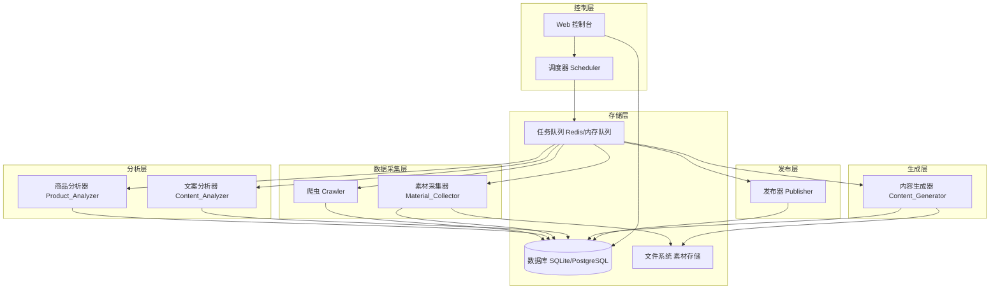

# 技术设计文档

## 概述

抖音带货自动化系统是一个多模块协作的自动化流水线，覆盖从爆款商品发现到视频发布的完整带货运营链路。系统采用模块化架构，各模块通过消息队列解耦，由调度器统一编排执行顺序，并提供 Web 控制台供用户监控和干预。

核心流程：
```
爬虫（Crawler）→ 商品分析（Product_Analyzer）→ 素材采集（Material_Collector）
→ 文案分析（Content_Analyzer）→ 内容生成（Content_Generator）→ 发布（Publisher）
```

系统设计目标：
- 全流程无人值守，支持定时自动运行
- 各模块独立可测试，故障隔离
- 支持人工审核介入点
- 完整的日志与告警机制

---

## 架构

### 整体架构图



### 技术选型

| 组件 | 技术选型 | 理由 |
|------|---------|------|
| 后端框架 | Python + FastAPI | 异步支持好，生态丰富，适合 IO 密集型任务 |
| 任务队列 | Celery + Redis | 成熟的分布式任务调度方案 |
| 数据库 | SQLite（开发）/ PostgreSQL（生产） | 轻量易部署，生产可升级 |
| 爬虫 | httpx + playwright | httpx 处理 API 请求，playwright 处理动态页面 |
| AI 重绘 | Stable Diffusion API / ComfyUI | 本地或云端图像生成 |
| 视频合成 | FFmpeg + MoviePy | 成熟的视频处理工具链 |
| 文案生成 | OpenAI API / 本地 LLM | 灵活切换云端或本地模型 |
| Web 控制台 | FastAPI + Jinja2 / Vue.js | 轻量前端，快速开发 |
| 抖音发布 | Playwright 自动化 / 抖音开放平台 API | 模拟登录或官方 API |

---

## 组件与接口

### 1. 调度器（Scheduler）

负责按流程顺序触发各模块，监控执行状态，处理失败重试和告警。

```python
class Scheduler:
    def run_pipeline(self, config: PipelineConfig) -> PipelineRun
    def trigger_module(self, module: ModuleType, task_id: str) -> Task
    def get_pipeline_status(self, run_id: str) -> PipelineStatus
    def pause_pipeline(self, run_id: str) -> None
    def resume_pipeline(self, run_id: str) -> None
    def send_alert(self, module: ModuleType, failure_count: int) -> None
```

### 2. 爬虫（Crawler）

从抖音平台抓取商品数据，控制请求频率，处理限流重试。

```python
class Crawler:
    def fetch_products(self, category: str | None = None) -> list[RawProduct]
    def fetch_product_metrics(self, product_id: str) -> ProductMetrics
    def fetch_video_list(self, product_id: str) -> list[RawVideo]
    # 内部：请求频率控制（≤30次/分钟）
    # 内部：限流重试（60秒间隔，最多3次）
```

### 3. 商品分析器（Product_Analyzer）

对爬取的商品数据进行评分和排序，输出爆款候选列表。

```python
class ProductAnalyzer:
    def score_products(self, products: list[RawProduct]) -> list[ScoredProduct]
    def get_trending_products(
        self, products: list[ScoredProduct], top_percent: float = 0.2
    ) -> list[TrendingProduct]
    def filter_by_category(
        self, products: list[TrendingProduct], category: str
    ) -> list[TrendingProduct]
```

### 4. 素材采集器（Material_Collector）

下载商品图片和视频，校验完整性，生成采集报告。

```python
class MaterialCollector:
    def collect_materials(self, products: list[TrendingProduct]) -> CollectionReport
    def download_image(self, url: str, product_id: str) -> DownloadResult
    def download_video(self, url: str, product_id: str) -> DownloadResult
    def verify_file_integrity(self, file_path: str, expected_hash: str | None) -> bool
    def deduplicate(self, urls: list[str]) -> list[str]
```

### 5. 文案分析器（Content_Analyzer）

提取视频文案，统计关键词和话题标签，输出结构化 JSON。

```python
class ContentAnalyzer:
    def extract_content(self, video: RawVideo) -> VideoContent | None
    def analyze_keywords(self, contents: list[VideoContent]) -> list[KeywordStat]
    def analyze_hashtags(self, contents: list[VideoContent]) -> list[HashtagStat]
    def analyze_title_patterns(self, contents: list[VideoContent]) -> list[PatternStat]
    def export_json(self, analysis: ContentAnalysis) -> str  # JSON 字符串
```

### 6. 内容生成器（Content_Generator）

基于素材和分析结果生成带货视频，支持人工审核模式。

```python
class ContentGenerator:
    def redraw_image(self, image_path: str, product: TrendingProduct) -> str  # 新图路径
    def generate_script(
        self, product: TrendingProduct, analysis: ContentAnalysis
    ) -> VideoScript  # 15-60秒
    def synthesize_video(
        self, script: VideoScript, images: list[str], bgm_path: str
    ) -> str  # 视频路径，≥1080×1920
    def generate_caption(
        self, product: TrendingProduct, analysis: ContentAnalysis
    ) -> VideoCaption
    def check_forbidden_words(self, text: str, forbidden_list: list[str]) -> bool
```

### 7. 发布器（Publisher）

将视频上传至抖音，挂载商品链接，支持定时发布。

```python
class Publisher:
    def upload_video(self, video_path: str, caption: VideoCaption) -> UploadResult
    def attach_product_link(self, video_id: str, product_id: str) -> AttachResult
    def schedule_publish(self, task: PublishTask, schedule: PublishSchedule) -> None
    def maintain_session(self) -> bool  # 维护登录态
    def get_publish_log(self, video_id: str) -> PublishLog
```

---

## 数据模型

### 核心数据结构

```python
from dataclasses import dataclass, field
from datetime import datetime
from enum import Enum
from typing import Optional

# ── 枚举 ──────────────────────────────────────────────

class TaskStatus(Enum):
    PENDING = "pending"
    RUNNING = "running"
    SUCCESS = "success"
    FAILED = "failed"
    SKIPPED = "skipped"

class ModuleType(Enum):
    CRAWLER = "crawler"
    PRODUCT_ANALYZER = "product_analyzer"
    MATERIAL_COLLECTOR = "material_collector"
    CONTENT_ANALYZER = "content_analyzer"
    CONTENT_GENERATOR = "content_generator"
    PUBLISHER = "publisher"

# ── 商品相关 ──────────────────────────────────────────

@dataclass
class RawProduct:
    product_id: str
    title: str
    category: str
    price: float
    sales_count: int
    likes: int
    comments: int
    shares: int
    crawled_at: datetime

@dataclass
class ProductMetrics:
    product_id: str
    sales_growth_rate: float   # 销量增长率
    engagement_score: float    # 互动综合评分
    composite_score: float     # 综合评分

@dataclass
class ScoredProduct:
    product: RawProduct
    metrics: ProductMetrics

@dataclass
class TrendingProduct:
    product_id: str
    title: str
    category: str
    composite_score: float
    rank: int

# ── 素材相关 ──────────────────────────────────────────

@dataclass
class DownloadResult:
    url: str
    product_id: str
    file_path: Optional[str]
    success: bool
    error_reason: Optional[str]
    file_hash: Optional[str]

@dataclass
class CollectionReport:
    product_id: str
    success_count: int
    failure_count: int
    failures: list[DownloadResult]
    generated_at: datetime

# ── 文案分析相关 ──────────────────────────────────────

@dataclass
class VideoContent:
    video_id: str
    title: str
    body: str
    hashtags: list[str]

@dataclass
class KeywordStat:
    keyword: str
    frequency: int

@dataclass
class HashtagStat:
    hashtag: str
    frequency: int

@dataclass
class PatternStat:
    pattern_type: str   # 如 "疑问句", "数字列表", "情感词"
    count: int
    percentage: float

@dataclass
class ContentAnalysis:
    top_keywords: list[KeywordStat]      # 前20个
    top_hashtags: list[HashtagStat]      # 前10个
    title_patterns: list[PatternStat]
    analyzed_at: datetime

# ── 内容生成相关 ──────────────────────────────────────

@dataclass
class VideoScript:
    product_id: str
    scenes: list[str]
    duration_seconds: int   # 15 ≤ duration ≤ 60
    voiceover_text: str

@dataclass
class VideoCaption:
    title: str
    body: str
    hashtags: list[str]
    has_forbidden_words: bool = False

# ── 发布相关 ──────────────────────────────────────────

@dataclass
class PublishSchedule:
    times: list[str]   # 如 ["10:00", "18:00", "21:00"]
    timezone: str = "Asia/Shanghai"

@dataclass
class UploadResult:
    video_id: Optional[str]
    success: bool
    error_reason: Optional[str]
    retry_count: int = 0

@dataclass
class AttachResult:
    video_id: str
    product_id: str
    success: bool
    error_reason: Optional[str]

@dataclass
class PublishLog:
    video_id: str
    published_at: datetime
    product_link: str
    status: TaskStatus

# ── 调度相关 ──────────────────────────────────────────

@dataclass
class PipelineConfig:
    category_filter: Optional[str]
    manual_review: bool = False
    forbidden_words: list[str] = field(default_factory=list)
    publish_schedule: Optional[PublishSchedule] = None
    alert_email: Optional[str] = None
    alert_webhook: Optional[str] = None

@dataclass
class PipelineRun:
    run_id: str
    started_at: datetime
    status: TaskStatus
    module_statuses: dict[ModuleType, TaskStatus]
    failure_counts: dict[ModuleType, int]
```

### 数据库表结构（简要）

```sql
-- 商品表
CREATE TABLE products (
    product_id TEXT PRIMARY KEY,
    title TEXT,
    category TEXT,
    composite_score REAL,
    crawled_at TIMESTAMP
);

-- 素材表
CREATE TABLE materials (
    id INTEGER PRIMARY KEY AUTOINCREMENT,
    product_id TEXT,
    file_path TEXT,
    file_type TEXT,  -- 'image' | 'video'
    file_hash TEXT,
    downloaded_at TIMESTAMP,
    FOREIGN KEY (product_id) REFERENCES products(product_id)
);

-- 发布日志表
CREATE TABLE publish_logs (
    id INTEGER PRIMARY KEY AUTOINCREMENT,
    video_id TEXT,
    product_id TEXT,
    published_at TIMESTAMP,
    product_link TEXT,
    status TEXT
);

-- 任务执行日志表
CREATE TABLE task_logs (
    id INTEGER PRIMARY KEY AUTOINCREMENT,
    run_id TEXT,
    module TEXT,
    status TEXT,
    started_at TIMESTAMP,
    finished_at TIMESTAMP,
    error_message TEXT
);
```

---

## 正确性属性

*属性（Property）是在系统所有有效执行中都应成立的特征或行为——本质上是对系统应做什么的形式化陈述。属性是人类可读规范与机器可验证正确性保证之间的桥梁。*

### 属性 1：商品筛选数量与排序正确性

*对于任意* 非空商品评分列表，筛选出的爆款候选商品数量应等于总数的前20%（向上取整），且筛选结果按综合评分严格降序排列，所有入选商品的评分均高于所有未入选商品的评分。

**验证需求：1.2, 1.3**

### 属性 2：类目过滤完整性

*对于任意* 商品列表和任意类目字符串，按类目过滤后的结果中，每一个商品的类目字段均等于指定类目，且原列表中属于该类目的商品均出现在结果中（无遗漏）。

**验证需求：1.4**

### 属性 3：爬虫重试次数上限

*对于任意* 导致接口错误或限流的请求，爬虫的实际重试次数不超过3次，且每次重试间隔不少于60秒。

**验证需求：1.5**

### 属性 4：请求频率控制

*对于任意* 连续执行的爬虫任务，在任意60秒时间窗口内，发出的HTTP请求总数不超过30次。

**验证需求：1.6**

### 属性 5：素材采集完整性与报告一致性

*对于任意* 爆款商品列表，采集完成后报告中的成功数量加失败数量等于尝试下载的总资源数，且每条失败记录均包含失败原因。

**验证需求：2.3, 2.4**

### 属性 6：素材存储路径包含商品ID

*对于任意* 成功下载的素材文件，其存储路径中包含对应商品的product_id作为目录层级。

**验证需求：2.2**

### 属性 7：素材去重幂等性

*对于任意* 已下载的素材URL，再次触发下载时，文件系统中该资源的文件数量不增加（幂等性）。

**验证需求：2.5**

### 属性 8：文件完整性校验与重下载

*对于任意* 下载后哈希值与预期不符的文件，系统应触发重新下载，直到文件完整或达到重试上限。

**验证需求：2.6**

### 属性 9：文案提取字段完整性

*对于任意* 包含有效文案的视频，提取结果必须同时包含title、body、hashtags三个字段，且hashtags为列表类型。

**验证需求：3.1**

### 属性 10：关键词与话题标签统计排序

*对于任意* 视频文案集合，输出的关键词列表长度不超过20且按频率降序排列；话题标签列表长度不超过10且按频率降序排列。

**验证需求：3.2, 3.3**

### 属性 11：标题模式占比之和为100%

*对于任意* 视频标题集合，分析输出的所有模式占比之和等于100%（允许浮点误差±0.01%）。

**验证需求：3.4**

### 属性 12：文案分析JSON往返序列化

*对于任意* ContentAnalysis对象，将其序列化为JSON字符串后再反序列化，应得到与原对象等价的对象（所有字段值相等）。

**验证需求：3.6**

### 属性 13：生成脚本时长约束

*对于任意* 商品和文案分析输入，生成的视频脚本duration_seconds字段值在[15, 60]闭区间内。

**验证需求：4.2**

### 属性 14：生成视频分辨率约束

*对于任意* 合成完成的带货视频，其宽度不低于1080像素，高度不低于1920像素（竖屏格式）。

**验证需求：4.3**

### 属性 15：生成文案包含高频关键词或话题标签

*对于任意* 商品和文案分析输入，生成的视频标题或正文文案中至少包含输入的top_keywords或top_hashtags中的一个词条。

**验证需求：4.4**

### 属性 16：单商品失败不影响其他商品处理

*对于任意* 包含多个商品的处理批次，若其中一个商品在内容生成阶段发生错误，其余商品应继续被处理，最终成功处理的商品数量等于总数减去失败数量。

**验证需求：4.5**

### 属性 17：违禁词过滤有效性

*对于任意* 违禁词列表和生成的视频文案，文案中不应包含违禁词列表中的任何词条（大小写不敏感匹配）。

**验证需求：4.7**

### 属性 18：上传重试次数上限

*对于任意* 导致上传失败的场景，发布器的实际重试次数不超过3次。

**验证需求：5.4**

### 属性 19：发布日志字段完整性

*对于任意* 完成的发布操作（无论成功或失败），发布日志中必须包含video_id、published_at、product_link、status四个字段，且均不为空。

**验证需求：5.6**

### 属性 20：模块执行顺序不变量

*对于任意* 流水线运行实例，各模块的实际启动时间戳顺序必须满足：Crawler < ProductAnalyzer < MaterialCollector < ContentAnalyzer < ContentGenerator < Publisher。

**验证需求：6.1**

### 属性 21：连续失败超5次触发告警

*对于任意* 模块，当该模块连续失败次数达到5次时，告警通知必须被触发恰好一次（不重复告警）。

**验证需求：6.5**

### 属性 22：30天日志保留策略

*对于任意* 任务执行日志，30天内的日志可通过查询接口检索到；超过30天的日志不应出现在查询结果中。

**验证需求：6.6**

---

## 错误处理

### 错误分类与处理策略

| 错误类型 | 发生模块 | 处理策略 |
|---------|---------|---------|
| 平台接口限流/错误 | Crawler | 等待60秒后重试，最多3次；超限后记录日志，跳过或暂停 |
| 素材资源不可访问 | Material_Collector | 跳过该资源，在报告中标记失败原因 |
| 文件完整性校验失败 | Material_Collector | 重新下载，直到完整或达到重试上限 |
| 视频文案为空 | Content_Analyzer | 跳过该视频，在分析报告中标注"文案缺失" |
| AI重绘/视频合成失败 | Content_Generator | 记录错误详情，跳过当前商品，继续处理下一个 |
| 视频上传失败 | Publisher | 等待5分钟后重试，最多3次；超限后记录失败原因 |
| 商品链接挂载失败 | Publisher | 记录失败原因，通过邮件/Webhook通知用户手动处理 |
| 登录态失效 | Publisher | 暂停发布任务，通知用户重新登录 |
| 模块连续失败≥5次 | Scheduler | 发送告警通知（邮件或Webhook） |
| 任意模块执行失败 | Scheduler | 根据配置：跳过当前任务继续 或 暂停整个流程 |

### 错误日志格式

所有错误日志统一包含以下字段：
```json
{
  "timestamp": "ISO8601时间戳",
  "module": "模块名称",
  "run_id": "流水线运行ID",
  "error_type": "错误类型",
  "error_message": "错误详情",
  "retry_count": 0,
  "context": {}
}
```

### 人工审核介入点

当用户启用 `manual_review: true` 时，流程在 Content_Generator 完成后暂停，等待用户通过 Web 控制台确认后继续发布。

---

## 测试策略

### 双轨测试方法

本系统采用单元测试与基于属性的测试（Property-Based Testing, PBT）相结合的方式，两者互补：

- **单元测试**：验证具体示例、边界条件和错误场景
- **属性测试**：通过随机输入验证普遍性规则，覆盖大量输入组合

### 属性测试配置

- **测试库**：Python 使用 [Hypothesis](https://hypothesis.readthedocs.io/)
- **每个属性测试最少运行100次迭代**（Hypothesis 默认100次，可通过 `@settings(max_examples=100)` 配置）
- 每个属性测试必须通过注释引用设计文档中的属性编号
- 标签格式：`# Feature: douyin-ecommerce-automation, Property {编号}: {属性描述}`

示例：
```python
from hypothesis import given, settings, strategies as st

# Feature: douyin-ecommerce-automation, Property 1: 商品筛选数量与排序正确性
@given(st.lists(st.builds(ScoredProduct, ...), min_size=1))
@settings(max_examples=100)
def test_trending_product_selection(products):
    result = analyzer.get_trending_products(products, top_percent=0.2)
    expected_count = math.ceil(len(products) * 0.2)
    assert len(result) == expected_count
    scores = [p.metrics.composite_score for p in result]
    assert scores == sorted(scores, reverse=True)
```

### 单元测试重点

单元测试聚焦以下场景，避免与属性测试重复：

1. **具体示例验证**
   - 空商品列表的处理
   - 单个商品的完整流水线执行
   - 特定违禁词被正确过滤

2. **边界条件**
   - 视频文案为空时的处理（需求 3.5）
   - 脚本时长恰好为15秒和60秒的边界值
   - 重试次数恰好达到上限时的行为

3. **集成测试**
   - 调度器按正确顺序触发各模块
   - 人工审核模式下流程暂停与恢复
   - 登录态失效时发布任务暂停

4. **错误场景**
   - 模拟平台接口返回429（限流）
   - 模拟文件下载中断
   - 模拟AI服务不可用

### 属性测试与需求对应表

| 属性编号 | 属性名称 | 对应需求 |
|---------|---------|---------|
| 属性 1 | 商品筛选数量与排序正确性 | 1.2, 1.3 |
| 属性 2 | 类目过滤完整性 | 1.4 |
| 属性 3 | 爬虫重试次数上限 | 1.5 |
| 属性 4 | 请求频率控制 | 1.6 |
| 属性 5 | 素材采集完整性与报告一致性 | 2.3, 2.4 |
| 属性 6 | 素材存储路径包含商品ID | 2.2 |
| 属性 7 | 素材去重幂等性 | 2.5 |
| 属性 8 | 文件完整性校验与重下载 | 2.6 |
| 属性 9 | 文案提取字段完整性 | 3.1 |
| 属性 10 | 关键词与话题标签统计排序 | 3.2, 3.3 |
| 属性 11 | 标题模式占比之和为100% | 3.4 |
| 属性 12 | 文案分析JSON往返序列化 | 3.6 |
| 属性 13 | 生成脚本时长约束 | 4.2 |
| 属性 14 | 生成视频分辨率约束 | 4.3 |
| 属性 15 | 生成文案包含高频关键词或话题标签 | 4.4 |
| 属性 16 | 单商品失败不影响其他商品处理 | 4.5 |
| 属性 17 | 违禁词过滤有效性 | 4.7 |
| 属性 18 | 上传重试次数上限 | 5.4 |
| 属性 19 | 发布日志字段完整性 | 5.6 |
| 属性 20 | 模块执行顺序不变量 | 6.1 |
| 属性 21 | 连续失败超5次触发告警 | 6.5 |
| 属性 22 | 30天日志保留策略 | 6.6 |
